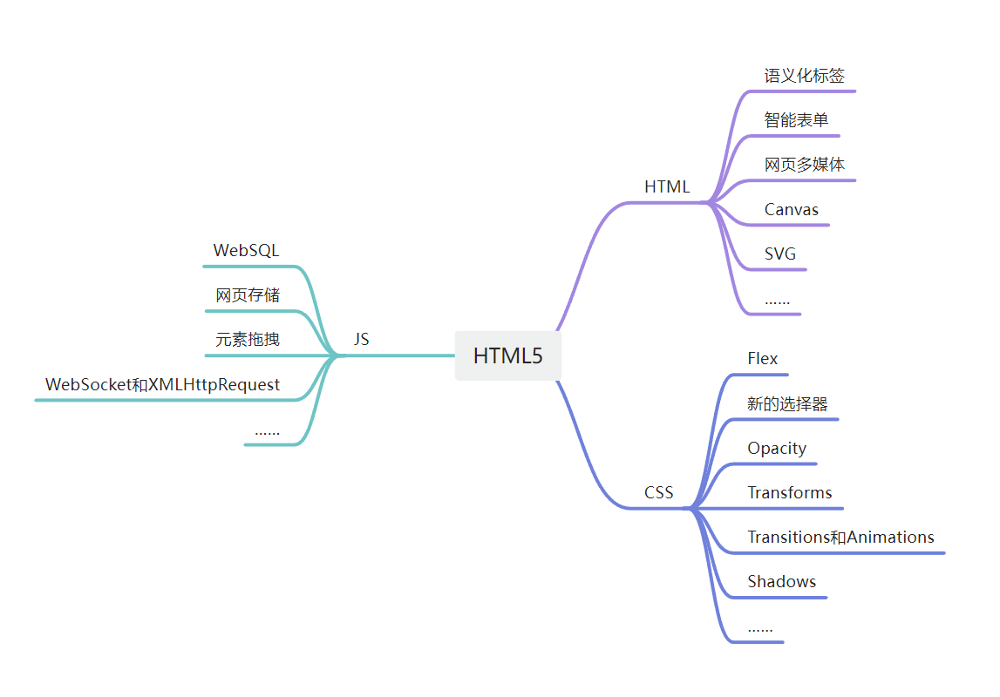

 

# HTML

## div和span的区别

``和`
`唯一的区别在于：``是不换行的，而`
`是换行的。

div在浏览器中，默认是不会增加任何的效果的，但是语义变了，div中的所有元素是一个小区域。 div标签是一个**容器级**标签，里面什么都能放，甚至可以放div自己。

span也是表达“小区域、小跨度”的标签，但只是一个**文本级**的标签。 就是说，span里面只能放置文字、图片、表单元素。 span里面不能放p、h、ul、dl、ol、div

## HTML5 新增的内容

## 语义化
语义化顾名思义就是能够让开发者更好的阅读和理计、让浏览器更好的解析、更好地SEO（搜索引擎优化）。

- `<section>` 表示区块
- `<article>` 表示文章。如文章、评论、帖子、博客
- `<header>` 表示页眉
- `<footer>` 表示页脚
- `<nav>` 表示导航
- `<aside>` 表示侧边栏。如文章的侧栏
- `<figure>` 表示媒介内容分组。
- `<mark>` 表示标记 (用得少)
- `<progress>` 表示进度 (用得少)
- `<time>` 表示日期

新语义标签与`
`、``没有区别，只是其具有表意性，可以理解成`
` 等同于`<header>`。

