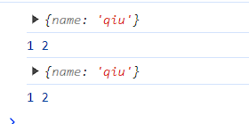
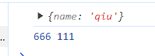
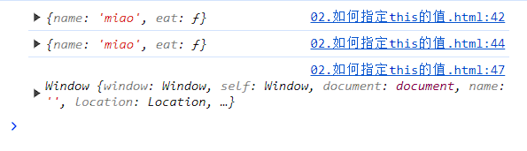
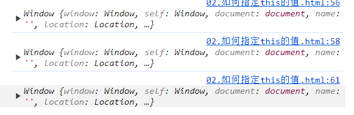

# JS 中 this

## this指向

1. 作为普通函数执行时，`this`指向`window`。

2. 当函数作为对象的方法被调用时，`this`就会指向`该对象`。

3. 构造器调用，`this`指向`返回的这个对象`。

4. ==箭头函数== 箭头函数的`this`绑定看的是this所在函数定义在哪个对象下，就绑定哪个对象。如果有嵌套的情况，则this绑定到最近的一层对象上。

5. 基于Function.prototype上的 `apply 、 call 和 bind `调用模式。
 `apply 、 call 和 bind `区别：

   - 三者都可以改变函数的this对象指向

   - 三者第一个参数都是this要指向的对象，如果没有参数或参数=undefined或null，则默认指向window

   - apply传参为数组、call为参数列表，且它们是一次性传入参数。bind可以分为多次传入

   - apply、call是立即执行；bind是返回绑定this之后的函数，便于稍后调用。

   - bind会返回一个新的函数，如果这个新函数作为构造函数创建一个新的对象。那么this指向用new创建的实例。


   :::warning 严格模式
    ```
    // 开启严格模式
    use strict
    ```
    1. 全局执行环境：严格模式，非严格模式都指向全局对象（window）
    2. 函数内部
        - 直接调用
          *  严格模式下:undefined
          *  非严格模式:全局对象（window）
        - 对象方法调用：严格模式，非严格模式都指向调用者

   :::


  ## 然后指定this的值
  
  1. 调用时指定：call方法和apply方法
  ```js
    function func(A, B) {
      console.log(this)
      console.log(A, B)
    }
    const person = {
      name: 'qiu'
    }
    // call方法
    func.call(person,1,2)
    // apply方法：数组传入
    func.apply(person,[1,2])
    // 打印结果：this都是指向person
  ```
  


  2. 创建时指定：bind方法和箭头函数
  ```js
 
   const bindFunc = func.bind(person, 666) // 不输出
   // 调用函数后打印结果
    bindFunc(111)
  
  ```
  

箭头函数
  ```js
  const cat = {
      name: 'miao',
      eat() {
        console.log(this) // 指向cat
        setTimeout(() => {
          console.log(this)
        }, 1000); // 箭头函数的定时器也指向

        // setTimeout(function () {
        //   console.log(this)
        // }, 1000) // 普通函数的定时器指向window
      }
    }
    cat.eat()
```



==当对象里的方法也为箭头函数时== 

```js
const cat2 = {
        name: "miao",
        eat: () => {
          console.log(this);
          setTimeout(() => {
            console.log(this);
          }, 1000);
          setTimeout(function () {
            console.log(this);
          }, 1000);
        },
      };
      cat2.eat();

      // 输出结果：this 都指向window
      // 箭头函数不绑定this，会捕获其所在的上下文的this值，作为自己的this值
```
