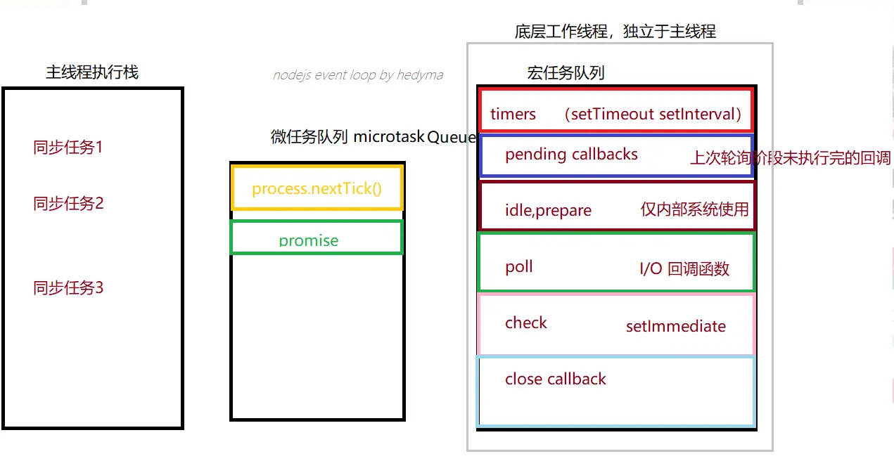

# js运行机制

JS是==单线程==的。

为了防止一个函数执行时间过长阻塞后面的代码，所以会先将同步代码压入执行栈中，依次执行。将异步代码推入异步队列，异步队列又分为==宏任务队列==和==微任务队列==，因为宏任务队列的执行时间较长，所以微任务队列要优先于宏任务队列。**同步任务没有执行完，队列里的异步任务是不会执行的**。

微任务队列有`Promise.then`，`MutationObserver`,`process.nextTick(Node.js 环境)`。只有一个微任务队列

宏任务队列有：`ajax`、`setImmediate`、`setTimeout`、`setInterval`。宏任务队列可以有多个，第一个宏任务队列中只有一个任务：执行主线程js代码

## 案例

1. new Promise 创建实例的过程是同步的
```js
 console.log(1);
 new Promise((resolve, reject) => {
    console.log(2);
 })
 console.log(3);
//  结果：1 2 3
```
2. Promise.then() | .catch() |  .finally()中的回调，是微任务
```js
console.log(1);
 new Promise((resolve, reject) => {
    console.log(2);
    resolve(); //  then 回调
    // reject(); //  catch 回调
 }).then(()=>{
    console.log('输出then回调')
 }).catch(()=>{
    console.log('输出catch回调')
}).finally(()=>{
    console.log('输出finally回调')
})
 console.log(3);
// 结果： 1 2 3 输出then回调 输出finally回调
```
3. 宏任务和微任务都存在
```js

setTimeout(function () { 
    console.log('1'); // 继续执行宏任务，第二个宏任务
});
 
new Promise(function (resolve) {
    console.log('2'); //同步宏任务 第1步 ，第一个宏任务是执行主线程上的代码
    resolve(); // 微任务
})
  .then(function () {
      console.log('3'); //执行微任务 第3步
  })
     
console.log('4');//同步宏任务 第2步 宏任务队列执行完成，执行微任务

// 结果：2 3 4 1
```
4. 宏任务包含微任务
```js
setTimeout(function () {
    console.log('1');
    new Promise(function (resolve) {
        console.log('2');
        resolve();
    })
      .then(function () {
          console.log('3');
      })
    console.log('4');
});
 
console.log('5');
// 结果：5 1 2 4 3
```
## Event Loop
 先会执行栈中的内容，栈中的内容执行后执行微任务，微任务清空后再执行宏任务，先取出一个宏任务，再去执行微任务，然后在取宏任务清微任务这样不停的循环。
 [^1]

### 步骤

1. 函数入栈，当Stack中执行到异步任务的时候，就将他丢给WebAPIs,接着执行同步任务,直到Stack为空；
2. 此期间WebAPIs完成这个事件，把回调函数放入队列中等待执行
3. 执行栈为空时，Event Loop把微任务队列执行清空；
4. 微任务队列清空后，进入宏任务队列，取队列的第一项任务放入Stack中执行，执行完成后，查看微任务队列是否有任务，有的话，清空微任务队列。重复4，继续从宏任务中取任务执行，执行完成之后，继续清空微任务，如此反复循环，直至清空所有的任务。

## nodejs轮询机制

1、主线程执行栈全部任务执行完毕。
2、检查微任务队列，process.nextTick优先级最高，总是最先执行。
3、检查宏任务队列，提取一次任务推入执行栈，进行执行。



nodejs事件轮训机制：借助libuv库实现，分为6个阶段
1. timers 定时器阶段 : 计时和执行到点的定时器回调函数
2. pengding callbacks ：某些系统操作（如：TCP错误类型）的回调函数
3. idle,prepare：准备工作
4. poll 轮询阶段
    - 如果轮询队列不为空，依次同步取出轮询队列中的第一个回调函数执行
    - 如果轮询队列为空：
        - 若之前设置过setImmediate函数，直接进入下一个check阶段
        - 若之前没有设置过setImmediate函数
            - 在当前poll阶段等待，直到轮询队列添加回调函数，就去第一个情况执行
            - 如果定时器到点了，也会去下一个阶段
5. check阶段：执行setImmediate设置的回调函数
6. close callbacks 关闭阶段：执行close事件回调函数


:::warning 注意
process.nextTick能在任意阶段优先执行
:::


[^1]:[深入浅出Javascript事件循环机制(上)](https://zhuanlan.zhihu.com/p/26229293)