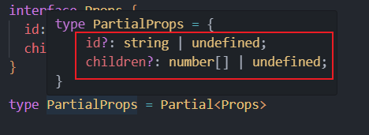
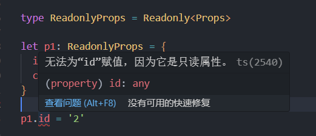
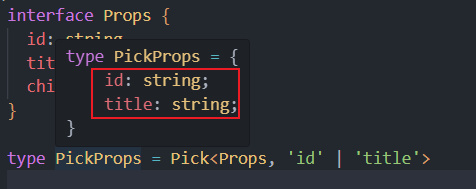
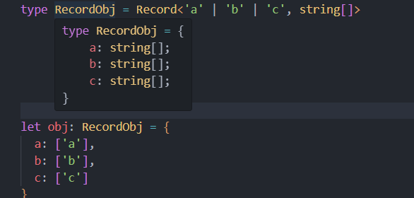
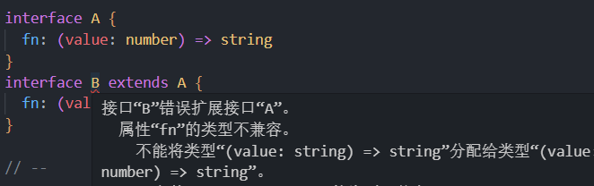
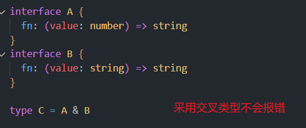

# 函数与泛型

## 函数
```javascript
let myAdd2: (x: string, y?: string) => string = 
function(x: string, y?: string): string {
  return x +' -'+ y
}
```

```typescript
function info(x: string, ...args: string[]) {
  console.log(x, args)
}
info('abc', 'c', 'b', 'a')
```

```typescript
/* 
函数重载: 函数名相同, 而形参不同的多个函数
需求: 我们有一个add函数，它可以接收2个string类型的参数进行拼接，也可以接收2个number类型的参数进行相加 
*/

// 重载函数声明
function add (x: string, y: string): string
function add (x: number, y: number): number

// 定义函数实现
function add(x: string | number, y: string | number): string | number {
  // 在实现上我们要注意严格判断两个参数的类型是否相等，而不能简单的写一个 x + y
  if (typeof x === 'string' && typeof y === 'string') {
    return x + y
  } else if (typeof x === 'number' && typeof y === 'number') {
    return x + y
  }
}

console.log(add(1, 2))
console.log(add('a', 'b'))
// console.log(add(1, 'a')) // error
```

## 泛型（重要）

定义一个函数或类时，有些情况下无法确定其中要使用的具体类型（返回值、参数、属性的类型不能确定），此时泛型便能够发挥作用。

```typescript
function test(arg: any): any{
	return arg;
}
```

上例中，test函数有一个参数类型不确定，但是能确定的时其返回值的类型和参数的类型是相同的，由于类型不确定所以参数和返回值均使用了any，但是很明显这样做是不合适的，首先使用any会关闭TS的类型检查，其次这样设置也不能体现出参数和返回值是相同的类型
**使用泛型**：

```typescript
function test<T>(arg: T): T{
	return arg;
}
```

这里的`<T>`就是泛型，T是我们给这个类型起的名字，设置泛型后即可在函数中使用T来表示该类型。

```ts
function test<T, K>(a: T, b: K): [T,K]{
    return [a,b];
}
// T指定为Number类型，K指定为string类型
test<number, string>(10, "hello");
// 简写 自动推断
test(10, "hello");
```

```typescript
// 在定义接口时, 为接口中的属性或方法定义泛型类型
// 在使用接口时, 再指定具体的泛型类型
interface IbaseCRUD <T> {
  data: T[]
  add: (t: T) => void
  getById: (id: number) => T
}

class User {
  id?: number; //id主键自增
  name: string; //姓名
  age: number; //年龄

  constructor (name, age) {
    this.name = name
    this.age = age
  }
}

class UserCRUD implements IbaseCRUD <User> {
  data: User[] = []
  
  add(user: User): void {
    user = {...user, id: Date.now()}
    this.data.push(user)
    console.log('保存user', user.id)
  }

  getById(id: number): User {
    return this.data.find(item => item.id===id)
  }
}


const userCRUD = new UserCRUD()
userCRUD.add(new User('tom', 12))
userCRUD.add(new User('tom2', 13))
console.log(userCRUD.data)
```

```ts
class MyClass<T>{
    prop: T;

    constructor(prop: T){
        this.prop = prop;
    }
}
```

### 泛型约束

如果我们直接对一个泛型参数取 length 属性, 会报错, 因为这个泛型根本就不知道它有这个属性
1. 使用T extends MyInter表示泛型T必须是MyInter的子类，不一定非要使用接口类和抽象类同样适用。 
```ts
interface MyInter{
    length: number;
}

function test<T extends MyInter>(arg: T): number{
    return arg.length;
}
```

2. 指定更加具体的类型

```ts
  function id<Type>(value: Type[]): Type[] {
    // []数组肯定有length属性
  console.log(value.length)
  return value
}
```
### 泛型工具
```ts
  interface Props {
  id: string
  children: number[]
}
```


1. `Partial<Type>`：创建一个类型，将Type的所有属性设置为可选。


```ts
type PartialProps = Partial<Props>
let p2: PartialProps = {
  id: '',
  children: [1, 3]
}

```
2. `Readonly<Type>`：创建一个类型，将Type的所有属性都设置为readonly（只读）

```ts
type ReadonlyProps = Readonly<Props>

let p1: ReadonlyProps = {
  id: '1',
  children: [1, 3]
}
// 报错，p1的属性为只读
p1.id = '2'
```

3. `Pick<Type, Keys>`：从 Type 中选择一组属性来构造新类型


4. `Record<Keys,Type>`：创建一个对象类型，属性键为Keys，属性类型为Type


## 交叉类型（&）
功能类似于接口继承（extends），用于组合多个类型为一个类型（常用于对象类型）
```ts
  interface A {name:string}
  interface B {age:number}
  // 交叉类型
  type C = A & B
  let obj : C ={name:'Q',age:23}
  // 相当于 type C = {name:string,age:number}
```

使用交叉类型后，新的类型 PersonDetail 就同时具备了 Person 和 Contact 的所有属性类型。

### 与extends对比
以下情况接口继承extends会报错

交叉类型不会报错
