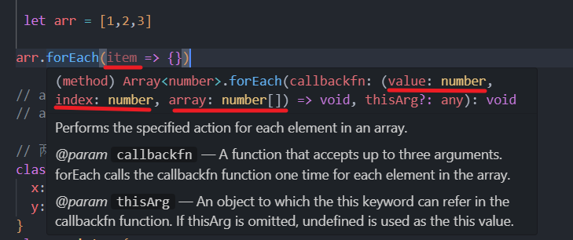

# 类型兼容性

将只有一个传入参数赋值给需3个参数的函数，并没有报错，因为发生了类型兼容。

```ts
 let arr:number[] = [1,2,3]
 arr.forEach(item => {})
// arr.forEach((item, index) => {})
// arr.forEach((item, index, array) => {})
```


 
以下代码并不会报错误
```ts
    // A 和 B是不同的类
    class A{x:number,y:number}
    class B{x:number,y:number}
    // C为A类型，但是是B的实例
    const C:A = new B()
```
原因：TS 是结构化类型系统[^1]，只检查A和B的结构是否相同，都有x,y属性且类型相同。（java是标明类型系统，这样写会报错）
```ts
    // 同样，成员多的可以赋值给少的
    class A{x:number,y:number}
    class D{x:number,y:number,z:number}
    // C为A类型，但是是D的实例
    const C:A = new D()
```
## 接口兼容性
和class兼容性类似，interface可以和class兼容。
```ts
    // 接口
    interface E {x: number y: number}
    // 类
    class F {x: number y: numberz: number}
    // 类和接口之间也是兼容的
    C:E = new F()
```


## 函数兼容性
参数数量、参数类型、返回值类型
1. 参数多的兼容参数少的（参数少的可以赋值给参数多的,与接口类兼容性相反）
2. 参数类型，相同位置的参数类型要相同（原始类型）或兼容（对象类型）
3. 返回值类型


[^1]: **结构化类型系统**：类型检查关注的是值所具有的形状。对于对象类型来说，D 的成员至少与A 相同，则 A 兼容 D
