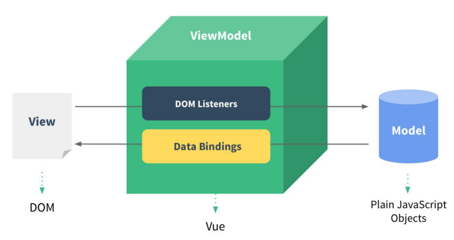

# Vue 的两个特性

## 数据驱动视图

1. 数据的变化**会驱动视图**自动更新

2. 好处：程序员只管把数据维护好，那么页面结构会被 vue 自动渲染出来！

## 双向数据绑定

在网页中，form 表单负责**采集数据**，Ajax 负责**提交数据**。

1. js 数据的变化，会被自动渲染到页面上

2. 页面上表单采集的数据发生变化的时候，会被 vue 自动获取到，并更新到 js 数据中

::: info 注意
1. 数据驱动视图和双向数据绑定的底层原理是 MVVM（Mode 数据源、View 视图、ViewModel ）

2. Model 表示当前页面渲染时所依赖的数据源。

3. View 表示当前页面所渲染的 DOM 结构。

4. ViewModel 表示 vue 的实例，它是 MVVM 的核心。

:::

## MVVM（重要）

视图模型双向绑定。`Model`层代表数据模型，`View`代表UI组件，`ViewModel`是`View`和`Model`层的桥梁，数据会绑定到`viewModel`层并自动将数据渲染到页面中，视图变化的时候会通知`viewModel`层更新数据。以前是操作DOM结构更新视图，现在是**数据驱动视图**。

**优点：**

1. 低耦合。视图（View）可以独立于Model变化和修改，一个Model可以绑定到不同的View上，当View变化的时候Model可以不变化，当Model变化的时候View也可以不变；
2. 可重用性。你可以把一些视图逻辑放在一个Model里面，让很多View重用这段视图逻辑；
3. 独立开发。开发人员可以专注于业务逻辑和数据的开发(ViewModel)，设计人员可以专注于页面设计；
4. 可测试。

### 底层实现原理

vue.js是采用**数据劫持**结合**发布者-订阅者模式**的方式，通过`Object.defineProperty()`来劫持各个属性的setter和getter，在数据变动时发布消息给订阅者，触发相应的监听回调。

