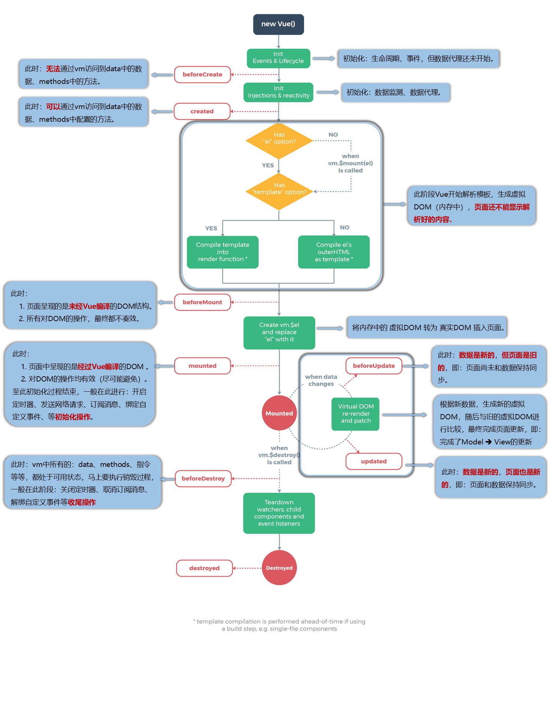

# 生命周期(重要)

以下为 vue2 生命周期的全过程图，须掌握每个生命周期阶段下各功能和含义。

生命周期函数中的 this 指向 vm 或组件实例对象

Vue 完成模版解析并把初始的真实 DOM 元素放入页面后调用 mounted

**八个阶段**

| 初始化显示                                                                                | 更新状态: this.xxx = value            | 销毁 vue 实例: vm.$destory()                                               |
| :---------------------------------------------------------------------------------------- | :------------------------------------ | :------------------------------------------------------------------------- |
| ==beforeCreate==（此时data和methods中的数据都还没有初始化）                                                                    | beforeUpdate() ：页面和数据未保持同步 | beforeDestory() ：清除定时器、解绑自定义事件、取消订阅消息等【收尾工作】。 |
| created（data中有值，未挂载）                                                                         | updated()                             | destoryed()                                                                |
| beforeMount（可以发起服务端请求，取数据）                                                                     |                                       |                                                                            |
| mounted（挂载后）：可以操作DOM，发送 ajax 请求、启动定时器、绑定自定义事件、订阅消息等【初始化操作】。 |                                       |                                                                            |

::: warning 销毁 Vue 实例

1.  销毁后自定义事件会失效，但原生 DOM 事件依然有效。

2.  一般不会在 beforeDestroy 操作数据，因为即便操作数据，也不会再触发更新流程了。
:::

:::info 组件生命周期重要

父组件beforeCreate ➡️ 父组件created ➡️ 父组件beforeMount ➡️ 子组件beforeCreate ➡️ 子组件created ➡️ 子组件beforeMount ➡️ 子组件 mounted  ➡️ 父组件mounted ➡️ 父组件beforeUpdate ➡️ 子beforeUpdate ➡️ 子updated ➡️ 父updated ➡️ 父beforeDestroy ➡️ 子beforeDestroy ➡️ 子destroyed ➡️ 父destroyed

:::