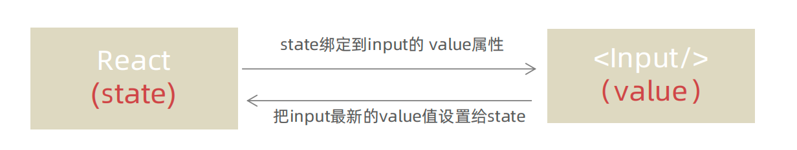

# react

特点

采用组件化模式、声明式编码，提高开发效率及组件复用率

在React Native中可以使用React语法进行移动端开发

使用虚拟DOM+优秀的Diffing 算法，尽量减少与真实DOM的交互，实现视图的高效更新


## 虚拟DOM

1. 本质是Object类型的对象 
2. 虚拟DOM最终会被React转化为真实DOM，呈现在页面上。

### 渲染虚拟DOM(元素)

1. 语法:  `ReactDOM.render(virtualDOM,containerDOM)`
2. 作用: 将虚拟DOM元素渲染到页面中的真实容器DOM中显示

```
import React from 'react'
import ReactDOM from 'react-dom'
import App from './App';
// 创建虚拟DOM
const root = ReactDOM.createRoot(document.getElementById('root'));
root.render(<App />);
```

::: info 执行流程

执行了ReactDOM.render(<MyComponent/>) 之后，发生了什么？

- React解析组件标签，找到了MyComponent组件。
- 发现组件是使用函数定义的，随后调用该函数，将返回的虚拟DOM转为真实DOM，随后呈现在页面中。

::: 
## JSX

写法：`var ele = <h1>Hello JSX!</h1>`

**语法规则**

1. 定义虚拟DOM时，不要写引号。

2. 标签中混入**JS表达式**时要用{}。

   ``` jsx
    <input  ref={c=>this.keyWordEl = c} type="text" />
   ```

3. 样式的类名指定不要用class，要用className。

   ```jsx
    render() {
       return (
         <div className="container">
         </div>
       );
     }
   ```

4. 内联样式，要用`style={{key:value}}`的形式去写。

   ```jsx
   <div style={{border:'1px', fontSize:'12px'}}></div>
   ```

5. 只有一个根标签

6. 标签必须闭合

7. 在 JSX 中注释语法：`{/* 中间是注释的内容 */}`

   

## React创建组件

react创建组件有两种方式：JS函数式和class式。

若组件仅仅是为了展示数据，那么可以使用函数组件；若组件中有一定业务逻辑，需要操作数据，那么就需要使用 class 类，需要使用 state。

只有通过class式创建的组件才有this属性（现在一般都采用函数式）

```jsx
//创建函数式组件
function MyComponent(){
	console.log(this); //this是undefined
	return <h2>函数定义的组件</h2>
}
// 创建类式组件
class MyComponent extends React.Component {
	render(){
	//this:MyComponent的实例对象 <=> MyComponent组件实例对象。
	console.log('render中的this:',this);
	return <h2>我是用类定义的组件(适用于【复杂组件】的定义)</h2>
	}
}

//渲染组件到页面
ReactDOM.render(<MyComponent/>,document.getElementById('test'))
```

## 事件处理

1. 通过onXxx属性指定事件处理函数(注意大小写)
    - React使用的是自定义(合成)事件, 而不是使用的原生DOM事件 
    - React中的事件是通过事件委托方式处理的(委托给组件最外层的元素)

2. 通过event.target得到发生事件的DOM元素对象 

```jsx
showData = (str)=>{
	return (event)=>{
		this.setState({[str]:event.target.value})
		}
}
   

<button onClick={this.showData('x')}>点我提示左侧的数据</button>
```

## 表单控制（onChange）
受控绑定：使用React组件的状态（useState）控制表单的状态


```jsx
	function App(){
  	const [value, setValue] = useState('')
  	return (
    	<input 
     	 type="text" 
      	value={value} 
     	 onChange={e => setValue(e.target.value)}
    	/>
  )
}
```

非受控绑定：通过获取DOM的方式获取表单的输入数据
```jsx
	function App(){
 	 const inputRef = useRef(null)
 	 const onChange = ()=>{
     console.log(inputRef.current.value)
  }
  
  return (
    <input 
      type="text" 
      ref={inputRef}
      onChange={onChange}
    />
  )
}
```


## state和props

### state

1. state是组件对象最重要的属性, 值是对象(可以包含多个key-value的组合)
2. 组件被称为"状态机", 通过更新组件的state来更新对应的页面显示(重新渲染组件）

```jsx
class Weather extends React.Component{
	//构造器调用1次
	constructor(props){
		super(props)
		//初始化状态
		this.state = {isHot:false,wind:'微风'}
		//解决changeWeather中this指向问题
		this.changeWeather = this.changeWeather.bind(this)
	}

	//render调用1+n次 1是初始化的那次 n是状态更新的次数
	render(){
		//读取状态
		const {isHot,wind} = this.state
		return <h1 onClick={this.changeWeather}>今天天气很{isHot ? '炎热' : '凉爽'}，{wind}</h1>
	}

	changeWeather(){
	//changeWeather在Weather的原型对象上，供实例使用
	//获取原来的isHot值
	const isHot = this.state.isHot
	//状态必须通过setState进行更新,且更新是一种合并，不是替换。
	this.setState({isHot:!isHot})
	console.log(this);
	//状态(state)不可直接更改
	//this.state.isHot = !isHot //error
	}
}
```

简写

```jsx
class Weather extends React.Component{
	//初始化状态
	state = {isHot:false,wind:'微风'}
	render(){
		const {isHot,wind} = this.state
		return <h1 onClick={this.changeWeather}>今天天气很{isHot ? '炎热' : '凉爽'}，{wind}</h1>
	}
	//自定义方法————要用赋值语句的形式+箭头函数
	changeWeather = ()=>{
		const isHot = this.state.isHot
		this.setState({isHot:!isHot})
	}
}
```


### props

1.  每个组件对象都会有props属性
2.  组件标签的所有属性都保存在props中
3.  props是只读的

``` jsx
class Person extends React.Component{
  constructor(props){
    //构造器是否接收props，是否传递给super，取决于：是否希望在构造器中通过this访问props
    // console.log(props);
    super(props)
    console.log('constructor',this.props);
  }

  //对标签属性进行类型、必要性的限制
  static propTypes = {
    name:PropTypes.string.isRequired, //限制name必传，且为字符串
    sex:PropTypes.string,//限制sex为字符串
    age:PropTypes.number,//限制age为数值
  }
  //指定默认标签属性值
  static defaultProps = {
    sex:'男',
    age:18 
  }

  render(){
    const {name,age,sex} = this.props   //props是只读的
    return (
      <ul>
        <li>姓名：{name}</li>
        <li>性别：{sex}</li>
        <li>年龄：{age+1}</li>
      </ul>
    )
  }
}
//渲染组件到页面
ReactDOM.render(<Person name="jerry"/>,document.getElementById('test1'))
```

### props校验

- 作用：通过类型检查，提高程序的稳定性
- 命令：`npm i -S prop-types`
- 使用：给类提供一个静态属性 `propTypes`（对象），来约束`props`

``` jsx
// 引入模块
import PropTypes from 'prop-types'

Person.propTypes = {
  name: PropTypes.string.isRequired,
  age: PropTypes.number. 
}
// 扩展属性: 将对象的所有属性通过props传递
<Person {...person}/>

//默认属性值
Person.defaultProps = {
  age: 18,
  sex:'男'
}
```

## ref

``` jsx
class Demo extends React.Component{
//React.createRef调用后可以返回一个容器，该容器可以存储被ref所标识的节点,该容器是“专人专用”的
	myRef = React.createRef()
	myRef2 = React.createRef()
	//展示左侧输入框的数据
	showData = ()=>{
		alert(this.myRef.current.value);
	}
	//展示右侧输入框的数据
	showData2 = ()=>{
		alert(this.myRef2.current.value);
	}
	render(){
		return(
		<div>
			<input ref={this.myRef} type="text" placeholder="点击按钮提示数据"/>&nbsp;
			<button onClick={this.showData}>点我提示左侧的数据</button>&nbsp;
			<input onBlur={this.showData2} ref={this.myRef2} type="text" placeholder="失去焦点提示数据"/>&nbsp;
		</div>
		)
	}
}
```

