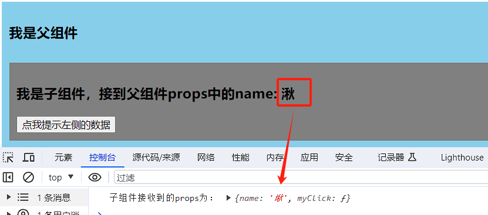
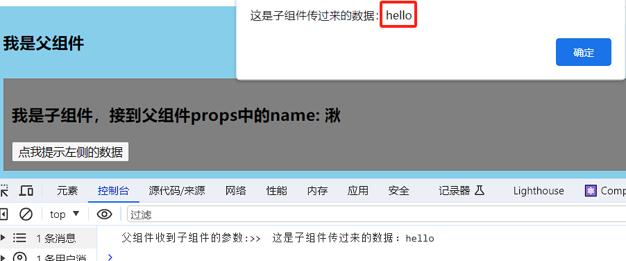
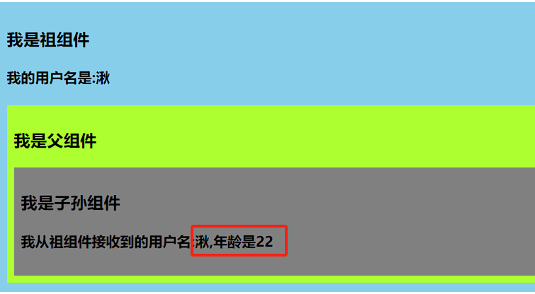

# React 组件通信 

在react组件间通信常见的几种情况有：父子组件通信、兄弟（非嵌套）组件通信、祖孙（跨级）组件通信。

## 父子组件通信

父组件向子组件通信只需采用props方式传递信息，子组件中也可以通过props获取这个值。

子组件向父组件则采用props + Callback的方式，父组件为子组件绑定一个函数属性，当子组件需要给父组件传值的时候，则通过props调用该函数将参数传入到该函数当中，此时就可以在父组件中的函数中接收到该参数。

```jsx
// 父 -> 子
export default class Parent extends Component {
  handleClick = (data) => {
    console.log("this :>> ", this);
    alert(data);
  };
  render() {
    return (
      <div className="parent">
        <h3>我是父组件</h3>
        {/* 通过props向子组件传name */}
        <Child name="湫" myClick={this.handleClick} />
      </div>
    );
  }
}
```

```jsx
// 子 -> 父
class Child extends Component {
  show = (a) => {
    this.props.myClick(`这是子组件传过来的数据：${a}`);
  };

  render() {
    console.log(this.props);
    const { name } = this.props;
    return (
      <div className="a">
        {/* 父 -> 子通信 */}
        <h3>我是子组件，接到父组件props中的name: {name}</h3>
        {/* 子 -> 父通信 */}
        <button onClick={() => this.show("hello")}>点我提示左侧的数据</button>
      </div>
    );
  }
}
```





## 祖孙（跨级）组件通信

1. 使用props，利用中间组件层层传递：如果父组件层数深，复杂度高。

### 2. 使用conText。

```jsx
import React, { Component } from 'react'
import './index.css'

//创建Context对象
const MyContext = React.createContext()
const {Provider,Consumer} = MyContext
export default class A extends Component {
	state = {username:'湫',age:22}
	render() {
		const {username,age} = this.state
		return (
			<div className="parent">
				<h3>我是祖组件</h3>
				<h4>我的用户名是:{username}</h4>
				<Provider value={{username,age}}>
					<B/>
				</Provider>
			</div>
		)
	}
}

class B extends Component {
	render() {
		return (
			<div className="child">
				<h3>我是父组件</h3>
				<C/>
			</div>
		)
	}
}

/* class C extends Component {
	//声明接收context
	static contextType = MyContext
	render() {
		const {username,age} = this.context
		return (
			<div className="grand">
				<h3>我是C组件</h3>
				<h4>我从A组件接收到的用户名:{username},年龄是{age}</h4>
			</div>
		)
	}
} */

function C(){
	return (
		<div className="grand">
			<h3>我是子孙组件</h3>
			<h4>我从祖组件接收到的用户名:
			<Consumer>
				{value => `${value.username},年龄是${value.age}`}
			</Consumer>
			</h4>
		</div>
	)
}
```


3. 采用redux全局管理的方式。
4. 采用消息订阅与发布的方式，使用`pubsub-js`

## 兄弟组件

兄弟组件即没有任何包含关系的组件，两个互不干涉的组件。可以采用redux和消息订阅与发布的方式。

