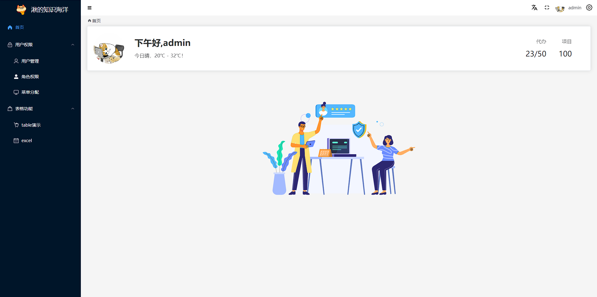
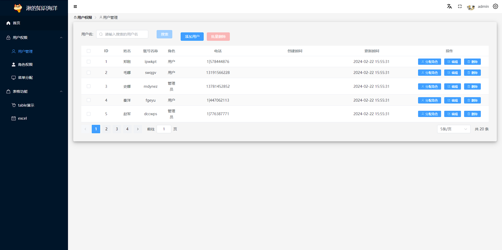

---
# 这是文章的标题
title: 湫管理系统（Vue3)
# 你可以自定义封面图片
order: 1
cover: /assets/images/bg1.jpg
icon: pen-to-square
date: 2022-01-01
article: false
category:
  - Ts
tag:
  - project
---

# 湫管理系统（Vue3)
## 介绍
​	[QiuSys（Vue3）](https://github.com/Q-JJ/Vue3-qiusys) 是一个基于 [Vue3.0](https://github.com/vuejs/core)、[Vite](https://github.com/vitejs/vite)、[Element-Plus](https://element-plus.org/zh-CN/)、[TypeScript](https://www.typescriptlang.org/) 的后台管理系统。包括二次封装组件、utils、权限校验、权限控制等功能，能作为项目的启动模版，以帮助您更快搭建管理系统，也可以作为一个学习示例，学习vue3+ts等主流技术的使用。面向人群：初学者、学生、企业。

<p style="background-Color:#dfeefd;padding:10px;border-radius:10px">系统如有bug，欢迎指正，共同交流。</p>


### 系统截图（部分）





## 初始化

该系统采用pnpm进行包管理，基于Vue3+vite+ts的模式，结合了piana、router等模块。采用Mock+axios进行模拟后台接口返回数据；整体UI采用Element-Plus实现。

### 环境准备

- node v16.16.0
- pnpm 8.10.0

#### 部分包管理

|              包              |  版本   |          包           | 版本     |
| :--------------------------: | :-----: | :-------------------: | -------- |
|             vue              | ^3.3.11 |      vue-router       | ^4.2.5   |
|            pinia             | ^2.1.7  |         vite          | ^5.0.8   |
|            axios             | ^1.6.7  |        lodash         | ^4.17.21 |
|           echarts            | ^5.5.0  |       nprogress       | ^0.2.0   |
|         element-plus         | ^2.5.5  |         sass          | ^1.70.0  |
| vite-plugin-vue-setup-extend | ^0.4.0  | vite-plugin-svg-icons | ^2.0.1   |
|            mockjs            | ^1.1.0  |       stylelint       | ^16.2.1  |

### 本地运行

```
# git拉取代码
clone https://github.com/Q-JJ/Vue3-qiusys.git

#安装依赖
pnpm i

#运行
pnpm run dev
```


