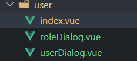

---
# 这是文章的标题
title: Vue3组件通信应用（porps/emit）
order: 7
headerDepth: 3
date: 2023-12-15
readingTime: N/A
word: N/A
lastUpdated: true
category:
  - 经验小记
tag:
  - 面试
---
# Vue3组件通信应用（porps/emit）

## dialog封装
  在写table相关页面中， 一般都会用dialog弹窗的功能来实现新增或修改的功能。这时候需要弹出很多个不同的弹出框，如果都在一个vue页面中写，会显得代码非常累赘和混乱，且复用性不强。这时候可以将dialog单独封装成一个组件，提高代码的可读性和复用性。

  封装成独立组件，需要考虑到组件之间的通信，Vue3中有很多组件通信的方式，这里结合功能采用porps/emit来实现，页面TS采用setup语法糖。props主要用于父子组件通信之间。

  user为用户管理页面，index在这里作为父组件，dialog作为子组件。



### 代码实现

在组件上使用 v-model 的时候，假如要传递的是一个 visible 属性（默认是 modelValue 属性），使用时是这样的 v-model:visible，它则是 v-bind:visible 和 v-on:update:visible 的结合

vue3中就实现了这个功能，v-model绑定的不再是value，而是modelValue，接收的方法也不再是input，而是update:modelValue。（v-model:modelValue等同于v-model）

`<UserDialog v-model:visible="dialogVisible" v-model:modelValue="data" />`

简写如下

`<UserDialog v-model:visible="dialogVisible" v-model="data" />`

```vue  
// index.vue
<template>
 ...
  <UserDialog
    v-if="dialogVisible"
    v-model:visible="dialogVisible"
    :title="dialogTitle"
    :data="userParams"
  ></UserDialog>
...
</template>

<script setup lang="ts" name="user">
 ...
import { onMounted, reactive, ref } from 'vue'
import { ElMessage } from 'element-plus'
import type { UserResponseData, User, Records } from '@/api/alc/user/type'
import UserDialog from './userDialog.vue'
// 弹窗是否显示
let dialogVisible = ref<boolean>(false)
// 弹窗标题
let dialogTitle = ref('')
// 用户参数（新增or修改）
let userParams = reactive<User>({
  username: '',
  name: '',
  password: '',
})

// 挂载初始化获取用户列表
onMounted(() => {
  getUserInfoList()
})
// 新增or修改
const userChange = (row?: User) => {
  dialogVisible.value = true
  if (row) {
    dialogTitle.value = '新增用户'
    Object.assign(userParams, row)
  } else {
    dialogTitle.value = '新增用户'
    Object.assign(userParams, {
      id: 0,
      username: '',
      name: '',
      password: '',
    })
  }
}

</script>
```

子组件采用defineProps方法（Vue3）来接受父组件传递过来的数据，参数可以是数组也可以是对象。

emit用来触发父组件里面绑定的函数并可以传参回父组件。

这里通过computed计算属性的get方法获取props中的dialogVisible属性，set方法是改变时触发的，则通过emit来更新 dialogVisible属性变化。

```vue
<template>
  <el-dialog v-model="dialogVisible" :title="props.title" width="500">
    <el-form :model="userParams" ref="formRef" :rules="rules">
     	...
    </el-form>
    <template #footer>
      <span class="dialog-footer">
        <el-button @click="dialogVisible = false">取消</el-button>
        <el-button type="primary" @click="handleClick">确认</el-button>
      </span>
    </template>
  </el-dialog>
</template>

<script setup lang="ts" name="userDialog">
import { reqAddOrUpdateUser } from '@/api/alc/user'
import { computed, ref } from 'vue'
import { ElMessage } from 'element-plus';
import type { User } from '@/api/alc/user/type'
  // 接收父组件传递的数据
const props = defineProps(['visible', 'title', 'data'])

const emit = defineEmits(['update:visible'])
//获取form组件实例
let formRef = ref<any>()
const dialogVisible = computed({
  get() {
    return props.visible
  },
  set(value) {
    emit('update:visible', value)
  },
})

let userParams: User = props.data

const handleClick = async () => {
  await formRef.value.validate()  
    let res =  await reqAddOrUpdateUser(userParams)
  if(res.code == 200){
    emit('update:visible', false)
    ElMessage({ type: 'success', message: userParams.id ? '更新成功' : '添加成功' });
    setTimeout(()=>window.location.reload(),500)
    
  }else{
    emit('update:visible', false)
    ElMessage({ type: 'error', message: userParams.id ? '更新失败' : '添加失败' });
  }
  
}
</script>
```


