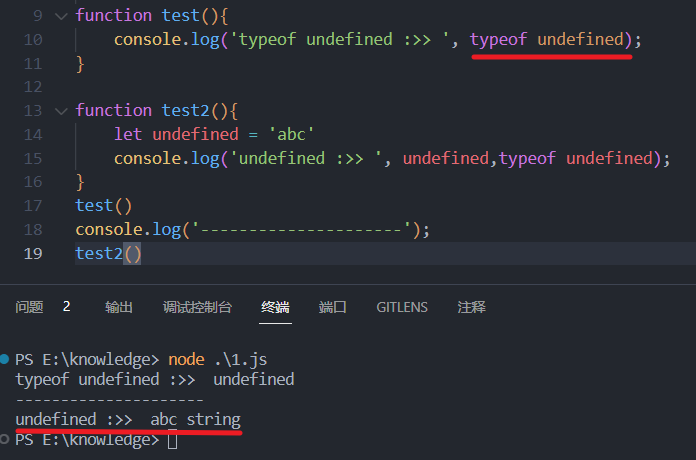

# 前端规范

毕业后正式当前端已经有一个多月了。发现在开发过程中一些命名格式和参数定义还是比较混乱的，今天抽空向大厂学习下前端规范。
在日常开发中，任何能`提高代码可维护性`、`降低代码理解成本`、`提高代码的容错率`和`提高项目可扩展性`的统一标准，称之为`规范标准`；
<!-- more -->

## 命名规范

### 命名法

- `Pascal Case 大驼峰式命名法`：首字母大写（UserInfo）
- `Case 小驼峰式命名法`：首字母小写（userInfo）
- `kebab-case 短横线隔开式`（user-info）

**文件资源命名**

- 文件名不得含有空格；

- 文件名建议只使用小写字母，不使用大写字母；

- 名称较长时采用半角连接符(-)分隔；

  ```
  usr/dev/document/front-end/project-vue3
  ```

**变量命名**：小驼峰

- 普通变量(`number, string, date`)；
- 布尔类型：需要一个标识变量含义的前缀，比如`has, is, wether, can, should`等；
- 数组/集合等复数形式：最好以`s`或`list`等能够标识复数形式的后缀结尾，标识当前变量是复数形式，提高可读性；
- 常量全部大写，且用下划线来分割单词，eg：`MAX_LENGTH = 1`

**函数**：小驼峰 ( 构造函数使用大驼峰 )

- 前缀为动词，动词 eg：`add / update / delete / detail / get`
- 方法命名必须是 动词 或者 动词+名词 形式

```
数据库：add / update / delete / detail / get
一些函数方法常用的动词（当单词累计）:
get 获取/set 设置,
add 增加/remove 删除,
create 创建/destory 销毁,
start 启动/stop 停止,
open 打开/close 关闭,
read 读取/write 写入,
load 载入/save 保存,
begin 开始/end 结束,
backup 备份/restore 恢复,
import 导入/export 导出,
split 分割/merge 合并,
inject 注入/extract 提取,
attach 附着/detach 脱离,
bind 绑定/separate 分离,
view 查看/browse 浏览,
edit 编辑/modify 修改,
select 选取/mark 标记,
copy 复制/paste 粘贴,
undo 撤销/redo 重做,
insert 插入/delete 移除,
add 加入/append 添加,
clean 清理/clear 清除,
index 索引/sort 排序,
find 查找/search 搜索,
increase 增加/decrease 减少,
play 播放/pause 暂停,
launch 启动/run 运行,
compile 编译/execute 执行,
debug 调试/trace 跟踪,
observe 观察/listen 监听,
build 构建/publish 发布,
input 输入/output 输出,
encode 编码/decode 解码,
encrypt 加密/decrypt 解密,
compress 压缩/decompress 解压缩,
pack 打包/unpack 解包,
parse 解析/emit 生成,
connect 连接/disconnect 断开,
send 发送/receive 接收,
download 下载/upload 上传,
refresh 刷新/synchronize 同步,
update 更新/revert 复原,
lock 锁定/unlock 解锁,
check out 签出/check in 签入,
submit 提交/commit 交付,
push 推/pull 拉,
expand 展开/collapse 折叠,
enter 进入/exit 退出,
abort 放弃/quit 离开,
obsolete 废弃/depreciate 废旧,
collect 收集/aggregate 聚集
```

### **css**

- 样式类名使用小写字母，以半角连接符(-)分割；

- id 采用驼峰式命名；

- scss / less 中的变量、函数、混合、placeholder 采用驼峰式命名

- 尽量使用缩写属性。比如 font 参数。

  ```css
  border-top: 0;
  font: 100%/1.6 palatino, georgia, serif; //采用缩写
  padding: 0 1em 2em;
  ```

> 禁止使用层级过深的选择器，最多 3 级。
>
> 除非有特定的功能、组件要求等，禁止随意使用 id 来定义元素样式，防止污染全局样式

#### LESS 规范

将公共 less 文件放置在 style/less/common 文件夹

按以下顺序组织：@import --> 变量声明 --> 样式声明;

#### 图片优化

1. 图片体积不能超过 300K

2. JPG 图片必须压缩，一般 80%品质即可，保证文字清晰

3. JPG 图片必须使用渐进式图片：使用 Photoshop 的“存储为 web 所用格式”时候，勾选“连续”

4. 透明 PNG 图片必须使用[压缩工具](https://tgideas.qq.com/doc/frontend/tool/imagecompress.html)压缩后提供

   ```
   bg.jpg          //背景图片
   mod-bg.jpg      //模块背景
   sprites.png     //精灵图
   btn-start.png   //开始按钮
   ico-play.png    //修饰性图片
   ```

### JS

#### undefined 判断

永远不要直接使用 undefined 进行变量判断；<span style="color:red">须使用 typeof 和字符串’undefined’对变量进行判断</span>。

这是因为 undefined 可以全局作用域中被当作标识符（变量名）来使用，<span style="color:red">undefined 不是一个保留字</span>。

如下图 1(定义一个名为 undefined 的变量赋予 string 类型后，undefined 的值和类型都已经改变)



#### 上下文的 this 的转换命名采用`self`命名

#### script 标签内部结构顺序

components > props > data > computed > watch > filter > 钩子函数（钩子函数按其执行顺序） > methods

```
src                                  源码目录
|-- api                              所有api接口
|-- assets                           静态资源，images, icons, styles等
|-- components                       公用组件
|-- config                           配置信息
|-- constants                        常量信息，项目所有Enum, 全局常量等
|-- directives                       自定义指令
|-- filters                          过滤器，全局工具
|-- datas                            模拟数据，临时存放
|-- lib                              外部引用的插件存放及修改文件
|-- mock                             模拟接口，临时存放
|-- plugins                          插件，全局使用
|-- router                           路由，统一管理
|-- store                            vuex, 统一管理
|-- themes                           自定义样式主题
|-- views                            视图目录
|   |-- role                                 role模块名
|   |-- |-- role-list.vue                    role列表页面
|   |-- |-- role-add.vue                     role新建页面
|   |-- |-- role-update.vue                  role更新页面
|   |-- |-- index.less                       role模块样式
|   |-- |-- components                       role模块通用组件文件夹
|   |-- employee                             employee模块
```

## Git 规范

**意义**

- 方便跟踪工程历史；
- 方便快速回溯代码；
- 方便 Code Review；
- 方便生成 CHANGELOG；
- 提高项目的整体质量，提高个人工程素质；

`功能分支工作流`是以`集中式工作流`为基础的。它提倡为各个新功能分配一个专门的分支来开发， 当功能分支稳定，或者说经过完备的测试之后才合并到 master 分支。

开发新功能时，需要从 dev 上拉一个 `feature-功能名称-开发姓名` 分支进行开发，例如：`feature-login-tgz`。开发完成后需要合并回 dev 分支。

### Commit 规范

```
<type>(<scope>): <subject>
// 注意冒号 : 后有空格
// 如 feat(user): 增加用户中心的 xx 功能
```

`scope` 表示 commit 的作用范围，如用户中心、购物车中心，也可以是目录名称，一般可以限定几种；

`subject` 用于对 commit 进行简短的描述；

`type` 必填，表示提交类型，值一般有以下几种：

- feat：新功能 feature
- bug：测试反馈 bug 列表中的 bug 号
- fix： 修复 bug
- ui：更新 UI；
- docs： 文档注释变更
- style： 代码格式(不影响代码运行的变动)；
- refactor： 重构、优化(既不增加新功能，也不是修复 bug)；
- perf： 性能优化；
- release：发布；
- deploy：部署；
- test： 增加测试
- chore： 构建过程或辅助工具的变动
- revert： 回退
- build： 打包

---

以上就是一些前端规范，一下子改掉不太适应，先慢慢学习慢慢来吧！
