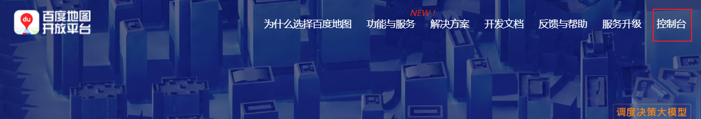

---
# 这是文章的标题
title: Vue 接入百度地图
order: 2
cover: /assets/images/cover1.jpg
headerDepth: 3
date: 2022-09-10
readingTime: N/A
word: N/A
lastUpdated: true
---

# Vue 接入百度地图

由于项目的需求，需要在平台首页的大屏中加入地图模块，主要用于显示当前各工程的所在位置及工程情况。

之前在大学参加计算机设计大赛期间，有用到百度地图的功能，比较熟悉，因此采用百度地图的 API 来实现这次的需求。
<!-- more -->

## 申请百度地图 AK


在使用之前，须进入[百度地图开放平台](https://lbsyun.baidu.com/) ,注册并申请百度地图的 AK。进入控制台页面，进行开发者认证。认证后点击应用管理中的我的应用，创建一个应用最后获得密钥（应用 AK）


## 使用 vue-baidu-map

1. 回到项目，安装或者引入 vue-baidu-map 插件[^first]

::: tabs#func
@tab npm#npm

```bash
npm install vue-baidu-map --save
```

@tab CDN 引入#cdn

```js
<script src="https://unpkg.com/vue-baidu-map"></script>
```

:::

2. 引用组件

- **全局注册**
  ::: tabs#func
  @tab npm#npm

  ```javascript
  //在main.js中引用
  import BaiduMap from "vue-baidu-map";
  Vue.use(BaiduMap, {
    // ak 是在百度地图开发者平台申请的密钥
    ak: "YOUR_APP_KEY",
  });
  ```

  @tab CDN 全局注册#cdn

```js
<script>
Vue.use(VueBaiduMap.default, {
  ak: 'YOUR_APP_KEY'
})
</script>
```

:::

- **局部引用**（按需引用，可以减少工程打包后的大小）

3. 在 main.js 引入后就可以开始使用了。以下是需要使用到地图的 vue 页面

   ```vue
   <template>
     <baidu-map class="map" center="北京"></baidu-map>
   </template>
   <style>
   .map {
    <!-- 地图的样式 -->
     width: 100%;
     height: 400px;
   }
   </style>
   ```

::: warning 提示

- `BaiduMap` 组件容器本身是一个空的块级元素，如果容器不定义高度，百度地图将渲染在一个高度为 0 不可见的容器内。

- 没有设置 `center` 和 `zoom` 属性的地图组件是不进行地图渲染的。当`center` 属性为合法地名字符串时例外，因为百度地图会根据地名自动调整 `zoom` 的值。

- 由于百度地图 JS API[^second]: 这是脚注内容 只有 JSONP 一种加载方式，因此 `BaiduMap` 组件及其所有子组件的渲染只能是异步的。因此，请使用在组件的 `ready` 事件[^3]来执行地图 API 加载完毕后才能执行的代码，不要试图在 vue 自身的生命周期中调用 `BMap` 类，更不要在这些时机修改 model 层。
  :::

## 实例-地图标记选择地址

接下来实现一个地图标记选择地址的功能吧！

<span style="color:red">需求</span>：在新建工程时、新建用户信息时可以通过它来详细的设置默认地址。

```vue
<!-- 
  地图弹出框
  引用了element UI的el-dialog
   -->
<template>
  <el-dialog
    title="地图"
    :visible.sync="dialogmap"
    @opened="open"
    :close-on-click-modal="false"
    append-to-body
  >
    <div class="mapbox">
      <!-- 
            引入baiduMap 
          1. center：地图初始化时地图指针默认地点，未指定则为北京市
             参数： { lng: 0, lat: 0 }
          2. zoom：地图缩放程度
             croll-wheel-zoom: 是否鼠标滚轮缩放

        -->
      <baidu-map
        class="map"
        :center="mapcenter"
        :zoom="15"
        :scroll-wheel-zoom="true"
        id="map_canvas"
        @click="mapmarker"
      >
        <bm-marker :position="map_pos" :dragging="true" @dragging="mapmarker">
        </bm-marker>
        <bm-control :offset="{ width: '10px', height: '10px' }">
          <bm-auto-complete
            :sugStyle="{ zIndex: 9999 }"
            v-if="dialogmap"
            v-model="map_search"
          >
            <input
              id="pac-input"
              class="controls"
              type="text"
              placeholder="搜索地图"
              destroy-on-close="true"
              v-model="map_search"
            />
            <!-- 这里指代一个自定义搜索框组件 -->
          </bm-auto-complete>
          <bm-local-search
            :keyword="map_search"
            :auto-viewport="true"
            location=""
            @searchcomplete="searchend"
            style="width: 0px; height: 0px; overflow: hidden"
            @markersset="setmarker"
          ></bm-local-search>
           </bm-control
        >
      </baidu-map>
    </div>
    <div slot="footer" class="dialog-footer">
      <el-button @click="dialogmap = false">取消</el-button>
      <el-button type="primary" @click="maplat">提交</el-button>
    </div>
  </el-dialog>
</template>

<script>
export default {
  name: "",
  data() {
    return {
      // 地图弹出框
      dialogmap: false,
      map_search: "",
      lat: "",
      mapcenter: "",
      map_pos: {},
      // 判断是否搜索
      issearch: true,
      form: {
        location: {},
        Address: "",
        Lng: null, //经度
        Lat: null, // 维度
      },
    };
  },
  methods: {
    // 地图标记选择地址
    mapBuild() {
      this.dialogmap = true;
    },
    open() {
      this.mapcenter = { lng: 113.461736, lat: 23.171955 };

      // 设置标记点的坐标值
      this.map_pos = { lng: 113.461736, lat: 23.171955 };
    },

    // 点击地图设置变成标记点
    // 拖拽标记点显示内容
    mapmarker(e) {
      this.issearch = false;
      var that = this;
      this.map_pos.lng = e.point.lng; // 通过  e.point.lng获取经度
      this.map_pos.lat = e.point.lat;
      this.mapcenter.lng = e.point.lng;
      this.mapcenter.lat = e.point.lat;

      let geocoder = new BMap.Geocoder(); // 创建地址解析器的实例
      geocoder.getLocation(e.point, (rs) => {
        //   //搜索确定的东西传递给搜索框
        that.map_search = rs.address;
        that.form.location = {
          location: e.point.lat + " , " + e.point.lng,
          address: rs.address,
        };
      });
    },

    searchend(val) {
      var that = this;
      that.issearch = true;
    },
    setmarker(val) {
      console.log(val);
    },

    maplat() {
      var that = this;
      console.log(this.mapcenter);
      if ((that.issearch = true)) {
        console.log("this :>> ", this);
        const geocoder = new BMap.Geocoder();
        geocoder.getPoint(that.map_search, function (res) {
          console.log("this2 :>> ", this);
          console.log("that :>> ", that);
          that.form.location = {
            location: res.lat + " , " + res.lng,
            address: that.map_search,
          };
          that.form.Lng = res.lng;
          that.form.Lat = res.lat;
          that.form.Address = that.map_search;
        });
      }
      console.log("获取地图后的form :>> ", this.form);
      this.lat = this.map_search; // 关闭弹出框
      this.dialogmap = false;
    },
  },
};
</script>
```

以上就是接入百度地图的基本操作，其他功能可以查看官方的开发文档。
[^first]: [vue-baidu-map 文档](https://dafrok.github.io/vue-baidu-map/#/zh/start/installation)

[^second]: [JS API 官方文档](https://lbsyun.baidu.com/index.php?title=jspopularGL)
[^3]: `ready`：地图组件渲染完毕时触发，返回一个百度地图的核心类和地图实例。在所需组件的 `ready` 事件回调函数的参数中获取`BMap`和`map`实例
