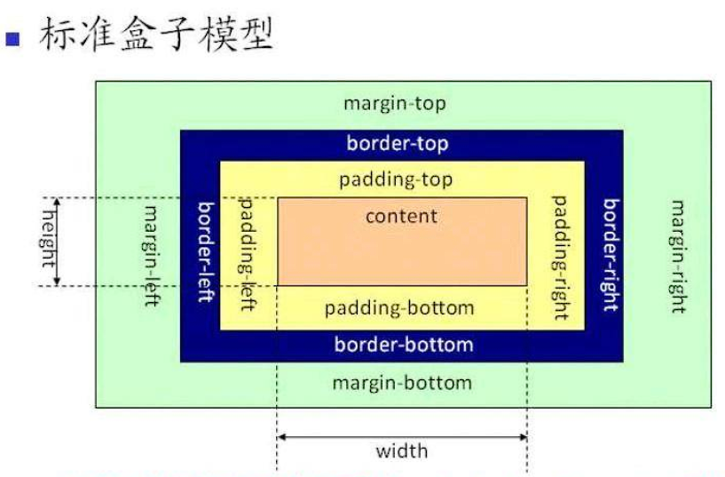
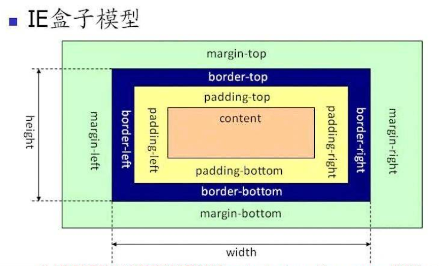

# CSS

CSS 中主要的面试点

## CSS3 新功能

CSS3 支持圆角、多背景、透明度、阴影、动画、图表等功能。

rem 是 css3 中新增加的一个单位属性(font size of the root element),根据页面的根节点的字体大小进行转变的单位。

- CSS3 渐变
- CSS3 字体(@font-face 规则)、CSS3 转换和变形、2D 转换方法、3D 转换属性、CSS3 过度（transition 属性）
- CSS3 动画（@keyframes 规则 animation 属性）
- CSS3 多列、CSS3 盒模型、CSS3 伸缩布局盒模型(弹性盒子)（flexbox）
- CSS3 多媒体查询（@media）
- 属性选择器；伪元素选择器（权重为 10）、结构伪类选择器（权重为 1）


主流浏览器内核私有属性 css 前缀：

- mozilla 内核 (firefox,flock 等) -moz

- webkit 内核(safari,chrome 等) -webkit

- opera 内核(opera 浏览器) -o

- trident 内核(ie 浏览器) -ms

## 继承

- 所有元素可继承：visibility 和 cursor。
- 内联元素可继承：letter-spacing、word-spacing、white-space、line-height、color、font、font-family、font-size、font-style、font-variant、font-weight、text-decoration、text-transform、direction。

  - 终端块状元素可继承：text-indent 和 text-align。

- 列表元素可继承：list-style、list-style-type、list-style-position、list-style-image。

## link 与@import 的区别

1. link 是 XHTML 标签，除了加载 CSS 外，还可以定义 RSS 等其他事务；@import 属于 CSS 范畴，只能加载 CSS。

2. link 引用 CSS 时，在页面载入时同时加载；@import 需要页面网页完全载入以后加载。

3. link 是 XHTML 标签，无兼容问题；@import 是在 CSS2.1 提出的，低版本的浏览器不支持。

4. link 支持使用 Javascript 控制 DOM 去改变样式；而@import 不支持。😯

## 伪类与伪元素

- 每条选择器最多只能包含一个伪元素；每条选择器可以包含多个伪类

- 伪元素的操作对象是新生成的 dom 元素，而不是原来 dom 结构里就存在的；而伪类恰好相反，伪类的操作对象是原来的 dom 结构里就存在的元素。😯

- 伪元素与伪类的**根本区别**在于：<span style="color:red">操作的对象元素是否存在于原来的 dom 结构里</span>。


## 盒子模型

​ 盒子模型：把 HTML 页面中的布局元素看作是一个矩形的盒子，也就是一个盛装内容的容器。

​ CSS 盒子模型本质上是一个盒子，封装周围的 HTML 元素，它包括：**边框**border、**外边距 margin**、**内边距 padding**、和 **实际内容 width/height**

:::info 盒子模型
在 **标准盒子模型**中，**width 和 height 指的是内容区域**的宽度和高度

**IE 盒子模型**中，**width 和 height 指的是内容区域+border+padding**的宽度和高度。
:::





## BFC（块级格式上下文）

`BFC`是一个独立的渲染区域，规定了内部 box 如何布局， 并且这个区域的子元素不会影响到外面的元素，其中比较重要的布局规则有内部 box 垂直放置，计算 BFC 的高度的时候，浮动元素也参与计算。

:::info 创建方式

- 根元素，即 HTML 元素
- float 的值不为 none
- position 为 absolute 或 fixed
- display 的值为 inline-block、table-cell、table-caption😯
- overflow 的值不为 visible😯
  :::

:::info 使用场景

- 去除边距重叠现象
- 清除浮动（让父元素的高度包含子浮动元素）
- 避免某元素被浮动元素覆盖
- 避免多列布局由于宽度计算四舍五入而自动换行
  :::

---

## 如何让一个元素水平垂直居中

1. 水平居中
   - 对于行内元素 : `text-align: center`;
   - 对于确定宽度的块级元素：
     - width 和 margin 实现。`margin: 0 auto`;
     - 绝对定位和 margin-left: (父 width - 子 width）/2, 前提是父元素 position: relative
   - 对于<span style="color:red">未知</span>宽度的块级元素
     - `table标签配合margin左右auto实现水平居中`。使用 table 标签（或直接将块级元素设值为 display:table），再通过给该标签添加左右 margin 为 auto。
     - inline-block 实现水平居中方法。display：inline-block 和 text-align:center 实现水平居中。😯
     - `绝对定位+transform`，translateX 可以移动本身元素的 50%。
     - flex 布局使用`justify-content:center`😯
2. 垂直居中
   - 利用 `line-height` 实现居中，这种方法适合**纯文字类**
   - 通过设置父容器 相对定位 ，子级设置 `绝对定位`，top,left,bottom,right = 0 、 margin: auto 实现自适应居中 😯
   - 弹性布局 flex :父级设置 display: flex; 子级设置 margin 为 auto 实现自适应居中 😯
   - 父级设置相对定位，子级设置绝对定位，并且通过位移 transform 实现
   - `table 布局`，父级通过转换成表格形式，`然后子级设置 vertical-align 实现`。（需要注意的是：😯vertical-align: middle 使用的前提条件是内联元素以及 display 值为 table-cell 的元素）。

## 隐藏页面中某个元素的方法

1. `opacity：0`不会改变页面布局，并且，如果该元素已经绑定 一些事件，如 click 事件，那么点击该区域，也能触发点击事件的
2. `visibility：hidden`不会改变页面布局，但是不会触发该元素已经绑定的事件 ，隐藏对应元素，在文档布局中仍保留原来的空间（会触发重绘）
3. `display：none`会改变页面布局，在文档布局中不再分配空间（会触发重排+重绘）

> 重排：当`DOM`的变化影响了元素的几何信息。表现为重新生成布局，重新排列元素。
>
> 重绘: 当一个元素的外观发生改变，但没有改变布局,重新把元素外观绘制出来的过程。改变元素的外观，不会引起网页重新生成布局 😯

## 清除浮动的方式 ✔️

- 添加额外标签

```html
<div class="parent">
  //添加额外标签并且添加clear属性
  <div style="clear:both"></div>
  //也可以加一个br标签
</div>
```

- 父级添加 overflow 属性，或者设置高度
- 建立伪类选择器清除浮动

```css
/*在css中添加:after伪元素*/
.parent:after {
  /* 设置添加子元素的内容是空 */
  content: "";
  /* 设置添加子元素为块级元素 */
  display: block;
  /* 设置添加的子元素的高度0 */
  height: 0;
  /* 设置添加子元素看不见 */
  visibility: hidden;
  /* 设置clear：both */
  clear: both;
}
```

## DOM 树

一共有 12 种节点类型，常用的有 4 种：

1、Document 类型（document 节点）——DOM 的“入口点”

2、Element 节点（元素节点）——HTML 标签，树构建块

3、Text 类型（文本节点）——包含文本

4、Comment 类型（注释节点）——有时我们可以将一些信息放入其中，它不会显示，但 JS 可以从 DOM 中读取它。
